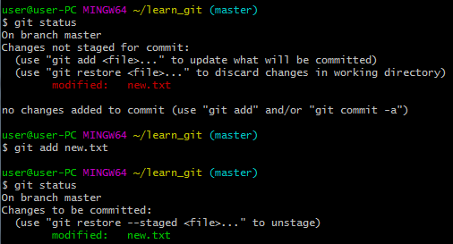

# Github 특강 - Basic

## git이란?

- 버전 관리 시스템으로써 오픈소스 커뮤니티에 참여해 개발하거나 프로그래밍 하기 위해 git과 github를 배운다.

## git 설치

1. git-scm.com에서 다운로드
2. 계속 next로 설치
3. windows에서 git, git bash, git CMD 등등 이 설치되어야 설치 완료
4. git bash 사용

## git 사용법

### 최초 설정

처음 컴퓨터에 git을 설치하고 git bash를 클릭하면 나오는 검은색 화면을 터미널 or CLI(Command Line Interface)라고 부른다. 프로그램 사용 전, 사용자의 이메일과 이름을 적어준다. 이는 앞으로 일어나는 커밋에 서명을 하기 위해서 필요하다.


```
$ git config -global user.name "이름"

$ git config -global user.email "이메일"
```

잘 설정되었나 확인하려면

```
$ git config user.name
이름 출력

$ git config user.email
이메일 출력
```


### 파일 생성

내가 원하는 폴더 내로 들어가서 파일을 생성하기 위해서는 몇가지 코드가 필요하다.

- mkdir <폴더이름>

  make directory <폴더이름>으로 현재 내가 위치한 곳에 폴더를 생성한다.

- cd <폴더이름>

  change directory <폴더이름>으로 폴더이름 내로 들어간다. 

- touch <문서이름.유형> 

  현재 위치에 파일을 생성한다.

- rm -r <문서이름>

  문서파일을 삭제하는 코드로 -rf를 사용하면 어떤 조건에서도 삭제가 가능하다.

- cd .. / cd ~

  상위폴더로 가기 / 홈 폴더로 가는 코드.


### 리스트 확인

상태 점검은 폴더 내에 있는 파일을 보여주고 ls or ls -a를 통해 진행한다.

```
$ ls
$ ls -a
```

$ ls -a는 폴더 내에 숨겨진 파일까지 확인할 수 있다.


### 상태 점검

상태 점검은 git status를 통해 알 수 있으며 자주 사용한다. 




```
$ git status
```

상태에 따라 위 사진처럼 여러가지 경우로 나뉜다.

파일이 초록색으로 나와야 정상적으로 동작할 수 있다.

### 초기화

초기화는 git init를 통해 진행한다.


`$ git init`

(master)가 써있다면 성공.

- rm -rf .git을 할 경우, (master)가 지워진다. but 최후의 수단으로 지우는 방법.

### add하기

add는 모르는 파일 / 수정된 파일을 Stage에 올리는 것이다.

```
$ git add <파일명>
```

이 상태가 되어야 commit이 가능하다. 즉 add -> commit 순서로 진행되어야 한다.

- add를 했지만 Stage에서 내리거나 수정하고 싶다면 restore --stage를 사용한다.

  ```
  $ restore --staged <파일명>
  ```

  

### Commit하기

commit은 설명이나 변경사항을 저장하는 것이다.


```
$ git commit -m "할 말"
```

- git commit 후에 :q!를 하면 저장하지 않고 끌 수 있다.

### log 보기

log는 commit된 내역을 볼 수 있는 명령어이다. 


```
$ git log
```

작성자, 시간, commit된 내용을 순차적으로 볼 수 있다.

### 원격 저장소 등록하기

리모트 : 네트워크나 인터넷 어딘가에 있는 저장소

```
$ git remote add origin <URL> # 원격 저장소 등록하기

$ git remote -v #원격 저장소 확인하기

$ git remote rm origin #origin을 삭제

$ git remote -v # 원격 저장소 확인하기

```

origin은 단지 이름으로써 내 마음대로 바꿀 수 있다.

### 원격 저장소에 push하기

자료를 remote에 저장하는 명령어

```
$ git push origin master # remote 이름이 origin일 경우에 master 브랜치를 PUSH하겠다.

$ git push origin branch # remote 이름이 origin일 경우에 master가 아닌 브랜치의 종류를 PUSH하겠다.
```

<<<<<<< HEAD
push의 루틴은 add -> commit -> push이다. 이 순서대로 해야 깃허브에 수정된 정보가 저장된다.

### 원격 저장소에 pull하기

remote에 저장된 자료를 받는 명령어

```
$ git pull origin master # remote 이름이 origin일 경우에 master 브랜치를 PULL하겠다.
```


### 추가

```
$ git commit --amend # git bash 내에서 commit을 변경할 수 있다.
```

```
vim # 타이포라 창을 git으로 확인할 수 있으며 변경사항이 있을 경우 수정이 가능하다.
I # 수정가능
ESC # 수정가능 끝내기(수정불가)
:w # 저장
:q # 밖으로 나오기
:wq # 저장 후 종료

=======
### 원격 저장소에 pull하기

```
$ git pull origin master # remote 이름이 origin일 경우에 master 브랜치를 PULL하겠다.
>>>>>>> 7f7ac42e033d071a59f160127c89c55dc8238970
```


## Summary

| 명령어                         | 설명                                               |
| ------------------------------ | -------------------------------------------------- |
| git init                       | 빈 디렉토리(폴더)를 git 저장소(repo)로 초기화한다. |
| git add <filename>             | <filename>을 Stage에 올린다.                       |
| git commit -m "commit message" | commit message를 저장한다.                         |
| got log                        | commit 내역을 확인할 수 있다.                      |


```